# 해금(Haegeum) — UAV/UGV 통합 VAE 이상탐지 & Red Agent 공격 시뮬레이션

> 유·무인 복합체계(MUM-T)의 센서 무결성을 실시간으로 검증하는 **L1 방어(Blue) 모듈**과, 이를 시험·평가하기 위한 **4단계 자동 공격 캠페인(Red Agent)**을 함께 담은 방산 AI 보안 프레임워크입니다.
>
> DAH 2026(국방 AI 해커톤) 출전작 · 팀 **해금**


> ⚠️ **범위 고지**: 이 저장소의 모든 공격/방어 코드는 **합성 데이터 기반 시뮬레이션**이며, ROS2 토픽 메시지 위·변조 실험에 한정됩니다. 실제 무기체계나 실기체에 대한 운용 정보를 포함하지 않습니다.

---

## 문제 정의

유·무인 복합체계(UAV/UGV)는 GPS·IMU·기압계·레이더·EO/IR 등 다수의 센서에 의존해 항법과 임무를 수행합니다. 그러나 이 센서 계층은 다음과 같은 위협에 직접 노출됩니다.

- **GPS 스푸핑 / 재밍** — 위조 위성 신호로 위치·속도 추정을 오염시켜 경로 이탈을 유도
- **데이터링크 하이재킹 / 명령 주입** — MAVLink 등 제어 링크를 가로채 고도·자세 명령을 위조
- **군집 드론 포화(Saturation)** — 다방향 동시 접근으로 탐지·분류·의사결정 파이프라인을 과부하

이러한 공격은 임무 시작 후 **수백 ms 단위**로 전개되므로, 클라우드 재분석을 기다릴 수 없습니다. 따라서 **기체 온보드(L1)에서 센서 스트림 자체의 이상 거동을 실시간으로 탐지**하는 자기 방어 계층이 필요합니다.

본 프로젝트는 정상 센서 패턴만 학습한 **VAE(Variational Autoencoder)** 로 재구성 오차 기반 이상탐지를 수행하고, **XAI(피처별 기여도)** 로 어떤 센서가 공격받았는지 식별합니다. 동시에, 방어 성능을 정량 평가하기 위한 **Red Agent 자동 공격 캠페인**을 함께 구현했습니다.

---

## 시스템 구조

각 노드는 ROS2(rclpy) 노드로 동작하며, `haegeum_interfaces` 커스텀 메시지가 없는 환경에서는 자동으로 시뮬레이션 모드로 폴백합니다.

```
                        ┌─────────────────────────────────────────────┐
                        │            Red Agent (공격 AI)               │
                        │   red_agent.py · advanced_attacks.py         │
                        │   RECON → EW → SWARM → PAYLOAD (4단계)        │
                        └───────────────┬─────────────────────────────┘
                                        │ 위조 센서/레이더/허위표적 주입
                                        ▼
   ┌────────────────┐        ┌────────────────────────┐
   │ sensor_publisher│──정상─▶│  /sensor_data/{robot}  │
   │  (정상 패턴)     │        │  /radar_tracks         │
   └────────────────┘        └───────────┬────────────┘
                                          ▼
                        ┌──────────────────────────────────────┐
                        │   anomaly_detector.py  (L1 방어)      │
                        │   ① VAE 센서 이상탐지 (GPS/IMU)        │
                        │   ② 레이더 트랙 군집 탐지 (SWARM)      │
                        │   ③ XAI 피처 기여도 → 공격유형 분류    │
                        └───────────────┬──────────────────────┘
                                        │ /target_detected (Event)
                                        ▼
                        ┌──────────────────────────────────────┐
                        │   target_fusion.py  (L2 엣지)         │
                        │   VAE(0.50)+Radar(0.35)+Camera(0.15)  │
                        │   가중 신뢰도 융합 → /fused_targets    │
                        └───────────────┬──────────────────────┘
                                        ▼
                        ┌──────────────────────────────────────┐
                        │  ai_commander (외부) → /assignment    │
                        │  ugv_agent.py / ugv_patrol.py 로 임무  │
                        └──────────────────────────────────────┘
```


### VAE 구조 (anomaly_detector.py / advanced_attacks.py 기준)

| 항목 | 값 |
|---|---|
| 입력 | 슬라이딩 윈도우 20 타임스텝 × 피처 수 (UAV 8 → 160차원, UGV 10 → 200차원) |
| 인코더 | Linear(input→128) → ReLU → Linear(128→64) → ReLU |
| Latent | `latent_dim = 16` (mu / logvar 분기, reparameterization) |
| 디코더 | Linear(16→64) → ReLU → Linear(64→128) → ReLU → Linear(128→input) |
| 이상 점수 | 재구성 MSE `mean((recon − x)²)` |
| 임계값 | **정상 검증셋 재구성 오차의 95th percentile** (calib_size=200 온라인 보정). 이는 곧 *목표 FPR 5 % 고정* 규칙이며 ROC 최적이 아닙니다 — 근거와 권고치는 「실험 결과」 3) 참조 |
| XAI | 윈도우 내 피처별 재구성 오차 평균 → argmax 피처를 `FEATURE_TO_ATTACK` 매핑으로 공격유형 분류 |

- **UAV 피처(8)**: `gps_vel_x/y`, `imu_ax/ay`, `residual_x/y`, `baro_alt`, `pitch_rate`
- **UGV 피처(10)**: `gps_vel_x/y`, `imu_ax/ay`, `residual_x/y`, `wheel_vel_l/r`, `cmd_vel_x/w`
- **핵심 아이디어**: `residual = GPS속도 − IMU가속도`. 정상 주행/비행에서는 ≈0 이지만, GPS만 위조되면 residual이 폭발 → 스푸핑을 물리 정합성 위반으로 탐지.

### 센서 융합 로직 (target_fusion.py)

- 3개 소스를 **가중 평균 신뢰도 융합**: VAE 0.50 / 레이더 0.35 / 카메라 0.15
- 동일 표적 판단: 유클리드 거리 `< 20m`(`FUSION_RADIUS`) 이면 동일 표적으로 병합
- 레이더 트랙 `[track_id, range_m, az_deg, el_deg, radial_vel, rcs_dbsm]` 을 극좌표→직교좌표 변환, RCS 기반 신뢰도 산정
- 5초 미갱신 표적은 stale 제거

---

## 위협 모델 / 공격 시나리오

Red Agent는 APT(지능형 지속 위협) 구조를 모사한 **4단계 캠페인**을 10Hz 루프로 자동 전개합니다. (`red_agent.py`)

| 단계 | 이름 | 공격 벡터 | 주입 파라미터 | MITRE ATT&CK for ICS |
|---|---|---|---|---|
| Phase 1 | RECON (정찰) | 저고도(15m)·저속(8m/s) 스카우트 드론 1대, 낮은 RCS(≈−10 dBsm) | `/radar_tracks` 단일 트랙 | T0842 Network Sniffing |
| Phase 2 | EW (전자전) | GPS 스푸핑 + 고도 스푸핑 + 명령 주입 | `gps_vel ±12m/s`, `baro_alt +25m`, `pitch_rate` 진동 | T0830 AiTM · T0855 Unauthorized Command |
| Phase 3 | SWARM (포화) | 군집 드론 6대, 360°/60° 간격 동시 접근(20m/s), 새떼 위장 RCS | `/radar_tracks` 다중 트랙 + 허위표적 flood | T0814 Denial of Service |
| Phase 4 | PAYLOAD (페이로드) | 우군 UGV `cmd_vel` 역방향 위조 → 임무 구역 이탈 | `cmd_vel = −1.0` | T0803 Block Command Message |

### 방어 관점 STANAG 4586 시나리오 커버리지

| 시나리오 | 탐지 피처 | 탐지 소스 |
|---|---|---|
| G-4 UGV 센서 스푸핑 | `residual_x/y` 폭발 | VAE |
| A-4 데이터링크 하이재킹 | `baro_alt`, `pitch_rate` | VAE |
| G-1 UGV 페이로드 탈취 | `wheel_vel`, `cmd_vel` | VAE |
| J-3 가용성 보전 | 낮은 오탐(FP) 유지 | VAE |
| SWARM 군집 재밍 | 동시 트랙 수 ≥ 3 & 접근속도 ≥ 15 m/s | 레이더 |

### 심화 실험 공격 유형 (advanced_attacks.py)

예선 이후 본선 추가 연구로, 단일 공격을 넘어선 **복합·점진적 공격**의 탐지 강건성을 검증했습니다.

- **복합 공격**: GPS+명령주입, GPS+고도 (두 센서 동시 오염)
- **점진적 스푸핑**: 값을 선형 램프로 서서히 증가시켜 임계값을 우회하려는 시도 (rate 0.1~0.5)
- **FP/FN 피처 분포 분석**: 오탐이 발생한 윈도우에서 어떤 피처가 정상 분포 대비 몇 σ 벗어났는지 정량화

---

## 실험 결과

### 1) 기본 3종 공격 — 혼동행렬 기반 (UAV/UGV 노트북)

아래 수치는 `UAV_anomaly_vae_SEAD.ipynb` / `UGV_anomaly_vae.ipynb` 의 혼동행렬 이미지에서 직접 산출한 값입니다. 공격 시계열 **전체**를 '공격'으로 라벨링한 기준입니다.

> **정정**: 이전 판 README 는 이 Recall 0.714 를 "경계(전이) 윈도우가 섞여서"라고 설명했습니다. 같은 하네스로 원인을 분해해 보니 **틀린 설명이었습니다.** 실제로는 FN 의 98.0 %가 *공격이 한 샘플도 주입되지 않은* 윈도우를 공격으로 라벨링한 데서 나오고, 경계 윈도우 기여는 2.0 %, 진짜 미탐은 0 건이었습니다. 자세한 분해는 아래 3) 의 「Recall 0.714 의 출처」.

**UAV (전체, TN=186 / FP=10 / FN=240 / TP=600)**

| 공격 유형 | Precision | Recall | F1 |
|---|---|---|---|
| GPS Spoofing | 0.953 | 0.718 | 0.819 |
| Altitude Spoofing | 0.952 | 0.714 | 0.816 |
| Command Injection | 0.952 | 0.711 | 0.814 |
| **전체(All)** | **0.984** | **0.714** | **0.828** |

**UGV (전체, TN=186 / FP=10 / FN=105 / TP=735)**

| 공격 유형 | Precision | Recall | F1 |
|---|---|---|---|
| GPS Spoofing | 0.954 | 0.739 | 0.833 |
| Wheel Slip | 0.963 | 0.918 | 0.940 |
| Cmd Anomaly | 0.964 | 0.968 | 0.966 |
| **전체(All)** | **0.987** | **0.875** | **0.927** |

| UAV 혼동행렬 | UGV 혼동행렬 |
|---|---|
| 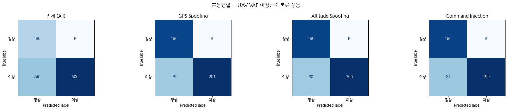 | 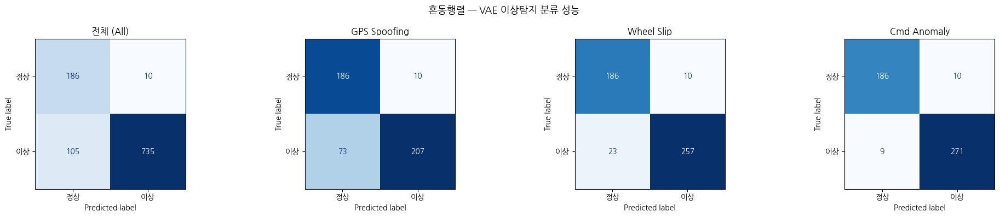 |

| UAV 피처별 기여도 (XAI, 노트북 산출) | UGV 피처별 기여도 (XAI, **재생성본**) |
|---|---|
| 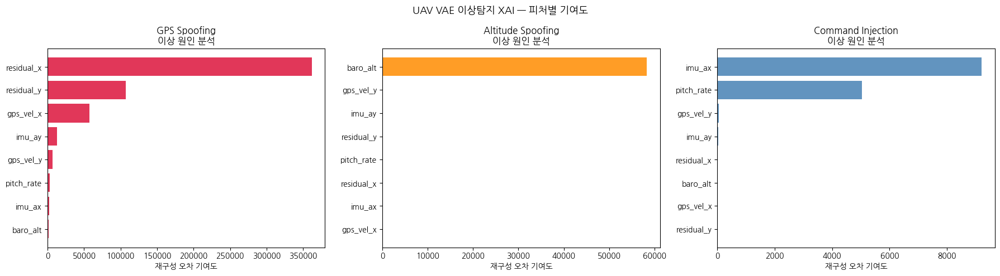 | 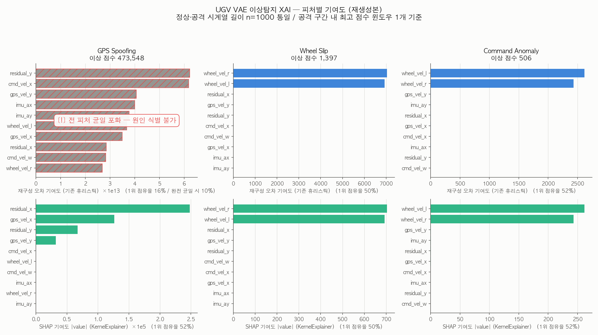 |

> UGV 그림은 초기 분석본의 두 가지 문제(정상/공격 시계열 길이 불일치로 인한 정규화 기준 붕괴, 극단 OOD 구간에서의 기여도 포화)를 교정해 `explainability/regen_ugv_feature_contribution.py` 로 재생성한 것입니다. 초기 분석본은 `docs/images/legacy/ugv_feature_contribution.png` 에 보존했으며, **그 GPS 패널은 신뢰 불가로 판정**되었습니다. 자세한 내용은 아래 「설명가능성 (SHAP)」 절.

### 2) 복합·점진적 공격 — 경계 윈도우 제외 평가 (advanced_attacks.py)

`advanced_attack_results.json` 기준. 공격 시작 후 19개 경계 윈도우를 평가에서 제외하고, 정상 100 + 공격 200 타임스텝(UAV)에 대해 측정한 값입니다. 임계값 = **1.2283** (정상 95th percentile).

> 아래 「실시간 추론 성능」의 양자화 비교표에는 같은 임계값이 **1.2301**로 나옵니다. VAE가 재파라미터화 샘플링을 쓰기 때문에 실행마다 정상 점수 분포가 미세하게 달라지는 것이며, 벤치마크 스크립트는 시드 42로 고정해 재측정한 값입니다. 두 값의 차이는 0.15 %로 판정 결과에 영향을 주지 않습니다.

| 공격 유형 | TP | FP | FN | Precision | Recall | F1 | 탐지 지연 |
|---|---|---|---|---|---|---|---|
| GPS Spoofing (예선) | 181 | 8 | 0 | 0.958 | 1.000 | 0.978 | 100 ms |
| Altitude Spoofing (예선) | 181 | 3 | 0 | 0.984 | 1.000 | 0.992 | 0 ms |
| Command Injection (예선) | 181 | 3 | 0 | 0.984 | 1.000 | 0.992 | 0 ms |
| 복합 A: GPS+CmdInj | 181 | 5 | 0 | 0.973 | 1.000 | 0.986 | 0 ms |
| 복합 B: GPS+Alt | 181 | 6 | 0 | 0.968 | 1.000 | 0.984 | 0 ms |
| 점진적 GPS (rate=0.3) | 181 | 5 | 0 | 0.973 | 1.000 | 0.986 | 200 ms |
| 점진적 GPS (rate=0.1) | 181 | 6 | 0 | 0.968 | 1.000 | 0.984 | 400 ms |
| 점진적 Alt (rate=0.5) | 181 | 5 | 0 | 0.973 | 1.000 | 0.986 | 300 ms |
| 점진적 Alt (rate=0.2) | 181 | 6 | 0 | 0.968 | 1.000 | 0.984 | 500 ms |

**핵심 관찰**
- 경계 구간을 제외하면 모든 공격에서 **미탐(FN) 0** — 일단 윈도우가 공격 데이터로 채워지면 100% 탐지.
- **점진적 스푸핑일수록 탐지 지연 증가**(rate 0.1 → 400 ms, rate 0.2 → 500 ms). 값을 천천히 올려 임계값을 우회하려는 공격은 탐지가 늦어짐을 정량 확인.
- 복합 공격(두 센서 동시)은 단일 공격 대비 탐지 성능 저하 없음.
- 남은 오탐(FP)은 대부분 `residual_x`, `pitch_rate` 등 분산이 큰 피처에서 정상 분포 2~3σ 지점에 발생.

| 기본/복합 공격 이상 점수 | 점진적 공격 탐지 지연 | FP/FN 피처 분포 |
|---|---|---|
| 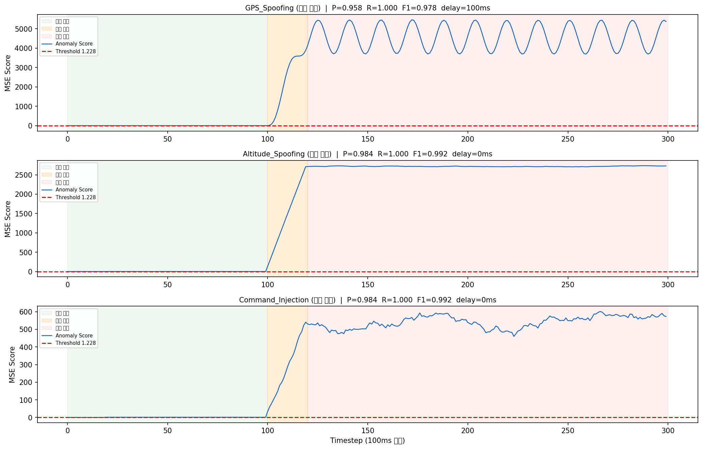 | 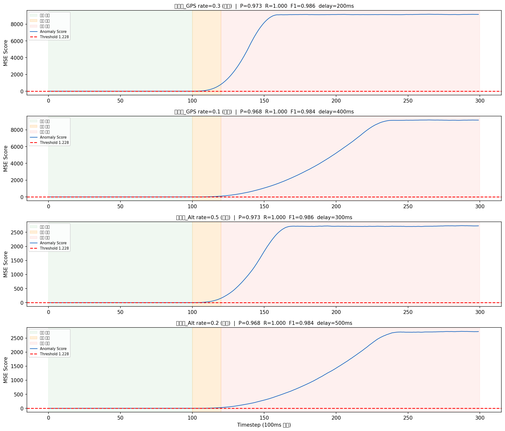 | 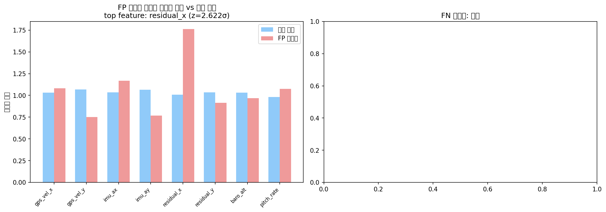 |

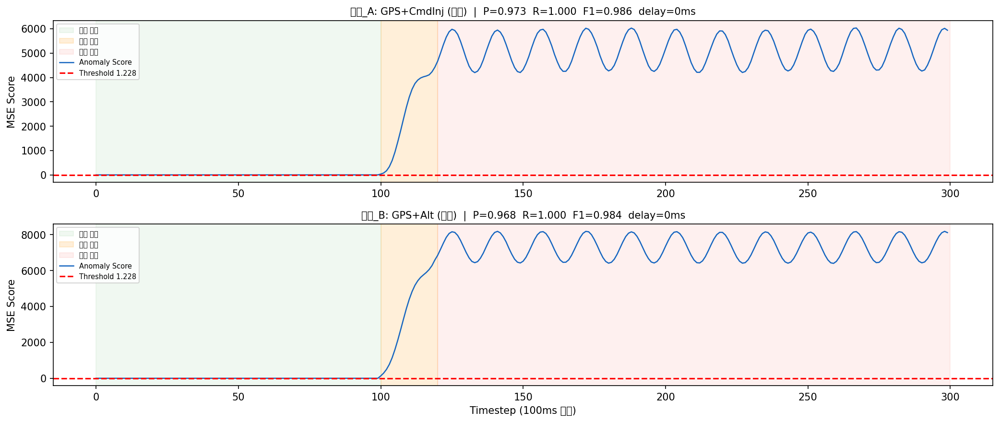

> 두 평가(1·2)의 Recall 차이는 **라벨링 방식**에서 비롯됩니다. 노트북(1)은 공격 시계열 전체를 양성으로 두고, 심화 실험(2)은 공격이 실제로 채워진 윈도우만 양성으로 둡니다. 그 차이를 수치로 분해한 결과가 아래 3) 입니다.

### 3) 임계값 선택 근거 — ROC 기반 재검토

`anomaly_detector.py` 의 임계값은 `threshold_percentile=95.0`, 즉 **정상 점수의 95th
percentile** 입니다. 공격 점수 분포를 한 번도 보지 않고 정한 값이므로 "왜 95인가"에
답할 수 없었습니다. `analysis/threshold_selection.py` 로 ROC·AUC 를 산출하고 선택 기준
6가지를 같은 평가셋에서 비교했습니다. 원시 결과는
[`analysis/threshold_results.json`](analysis/threshold_results.json).

**평가셋** — 임계값을 정하는 보정셋과 오탐을 세는 정상 데이터를 다른 시드로 분리하고,
공격 데이터로 완전히 채워진 윈도우만 양성으로 라벨링했습니다.

| 구분 | 구성 | 윈도우 수 (UAV / UGV) |
|---|---|---|
| 보정셋 | 임계값 산출용 정상 (`seed=42`, 기존 구현과 동일) | 981 / 197 |
| 음성셋 | 보정에 쓰지 않은 held-out 정상 (`seed=123`) | 981 / 981 |
| 양성셋(명목) | 공격 9종(UAV) / 3종(UGV) 중 **공격으로 완전히 채워진** 윈도우 | 1,629 / 1,327 |
| 양성셋(한계 근방) | 주입 크기를 정상 피처 σ 단위로 줄인 약한 공격 | 905 / 1,944 |

점수 경로·판정 규칙은 `anomaly_detector._infer()` 와 동일(`score > threshold`, strict)하며,
샘플링 난수는 시드 42로 고정했습니다. 아래 수치는 호스트(Apple M5 / Python 3.14.3 /
PyTorch 2.11.0 CPU)와 Docker 컨테이너(Python 3.12 / linux-arm64)에서 소수점 넷째 자리까지
동일하게 재현됩니다.

**(a) 명목 강도에서는 AUC = 1.0000 — 기준 간 우열을 가릴 수 없습니다**

| 플랫폼 | AUC (공격 전체) | AUC (기본 3종) | 정상 점수 최대 | 공격 점수 최소 | 완전 분리 구간 |
|---|---|---|---|---|---|
| UAV | 1.0000 | 1.0000 | 1.4553 | 22.1077 | [1.4553, 22.1077] |
| UGV | 1.0000 | 1.0000 | 1.4393 | 480.1939 | [1.4393, 480.1939] |

공격별 AUC 도 9종/3종 모두 1.0000 입니다. 여기서 두 가지가 동시에 드러납니다.

- **현재 임계값은 ROC 상에서 파레토 열위입니다.** UAV 1.2301 은 정상 점수 최댓값
  1.4553 보다 **낮습니다**. 즉 정상 분포의 꼬리 안에 들어가 있어, Recall 1.000 을 그대로
  유지하면서 FPR 만 3.26 % 더 내고 있습니다. 분리 구간으로 올리면 **Recall 1.000 유지 ·
  FPR 3.26 % → 0 %**. UGV 도 같습니다(1.1886 → 1.4393, FPR 9.17 % → 0 %).
  문제는 "임계값이 보수적"이 아니라 "임계값이 정상 분포 안에 있다" 였습니다.
- **동시에 이 평가셋이 너무 쉽습니다.** 모든 기준(Youden's J, 목표 FPR 1 %/5 %, F1 최대,
  비용 최소)이 같은 값 1.4553 으로 수렴합니다. AUC 1.0 인 합성 데이터에서는 ROC 가
  임계값을 골라 주지 못합니다.

**(b) 탐지 한계 근방 — 여기서 비로소 기준이 갈립니다**

주입 크기를 정상 피처 표준편차의 m배로 줄여 가며 AUC 를 측정했습니다.

| 플랫폼 · 주입 대상 | 0.05σ | 0.1σ | 0.2σ | 0.5σ | 1.0σ | 2.0σ |
|---|---|---|---|---|---|---|
| UAV GPS (`gps_vel` + `residual`) | 0.7443 | **0.9847** | 1.0000 | 1.0000 | 1.0000 | 1.0000 |
| UAV 고도 (`baro_alt`) | 0.5402 | 0.5419 | 0.5508 | 0.6171 | 0.8169 | **0.9982** |
| UGV GPS (`gps_vel` + `residual`) | 0.4584 | 0.4666 | 0.4974 | 0.6855 | **0.9782** | 1.0000 |
| UGV 휠 (`wheel_vel_l/r`) | 0.4547 | 0.4569 | 0.4681 | 0.5570 | 0.8177 | **0.9999** |

GPS 계열이 가장 민감한 것은 `residual = GPS − IMU` 가 같은 편향을 한 번 더 증폭해
4개 피처를 동시에 흔들기 때문입니다. 단일 채널만 건드리는 고도·휠 공격은 **1~2σ**
가 필요합니다. 이 표가 이 모델의 실제 탐지 하한입니다.

AUC 가 0.60~0.999 구간인 강도만 모아(UAV 905 · UGV 1,944 윈도우) 기준별로 비교했습니다.

**UAV (한계 근방 평가셋, AUC = 0.8322)**

| 기준 | 임계값 | Precision | Recall | F1 | FPR | 오경보/시간 |
|---|---|---|---|---|---|---|
| 현재값 (정상 95p) | 1.2301 | 0.924 | 0.431 | 0.588 | 0.0326 | 1,174 |
| 목표 FPR 1 % | 1.3021 | 0.971 | 0.334 | 0.497 | 0.0092 | 330 |
| 목표 FPR 5 % | 1.2034 | 0.898 | 0.477 | 0.623 | 0.0499 | 1,798 |
| Youden's J | 1.0891 | 0.749 | 0.705 | 0.726 | 0.2181 | 7,853 |
| F1 최대 | 1.0005 | 0.627 | 0.894 | 0.737 | 0.4913 | 17,688 |
| 비용 최소 (FN:FP = 10:1) | 0.9129 | 0.536 | 0.995 | 0.697 | 0.7931 | 28,550 |

**UGV (한계 근방 평가셋, AUC = 0.8271)**

| 기준 | 임계값 | Precision | Recall | F1 | FPR | 오경보/시간 |
|---|---|---|---|---|---|---|
| 현재값 (정상 95p) | 1.1886 | 0.916 | 0.506 | 0.652 | 0.0917 | 3,303 |
| 목표 FPR 1 % | 1.3690 | 0.976 | 0.185 | 0.311 | 0.0092 | 330 |
| 목표 FPR 5 % | 1.2353 | 0.941 | 0.405 | 0.566 | 0.0499 | 1,798 |
| Youden's J | 1.0906 | 0.865 | 0.737 | 0.796 | 0.2283 | 8,220 |
| F1 최대 | 0.9793 | 0.779 | 0.916 | 0.842 | 0.5138 | 18,495 |
| 비용 최소 (FN:FP = 10:1) | 0.7887 | 0.674 | 1.000 | 0.805 | 0.9592 | 34,532 |

오경보/시간 = FPR × 10 Hz × 3600 (센서 주기 기준 원시값). `cooldown_sec=2.0` 이 걸리면
실제 발행은 시간당 1,800건에서 포화하므로, FPR 이 5 %만 넘어도 **2초마다 한 번씩 계속
울리는 상태**가 됩니다.

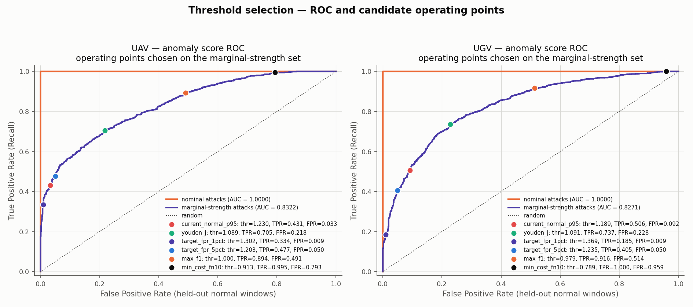
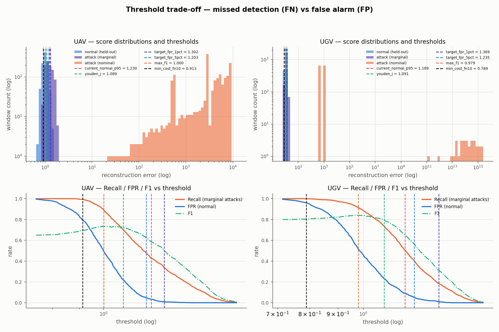
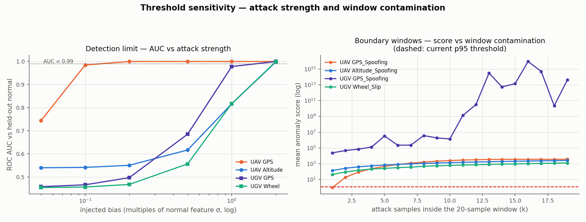

**(c) 운용 관점 — 미탐(FN)과 오탐(FP)의 비용은 같지 않습니다**

감시 체계에서 미탐 1건은 임무 실패로 직결되고 오탐 1건은 운용자 확인 부담입니다.
비용비를 바꿔 가며 최적 임계값을 다시 풀었습니다 (UAV, 한계 근방 평가셋).

| FN:FP 비용비 | 임계값 | Recall | FPR | 오경보/시간 |
|---|---|---|---|---|
| 1 : 1 | 1.1276 | 0.620 | 0.1376 | 4,954 |
| 3 : 1 | 0.9720 | 0.940 | 0.6004 | 21,615 |
| 10 : 1 | 0.9129 | 0.995 | 0.7931 | 28,550 |
| 30 : 1 | 0.8836 | 1.000 | 0.8665 | 31,193 |
| 100 : 1 | 0.8836 | 1.000 | 0.8665 | 31,193 |

**정량적 결론**: 한계 근방 공격의 Recall 을 0.431 → 0.995 로 끌어올리는 대가는
FPR 3.26 % → 79.3 % 입니다. 윈도우 수로는 탐지 **+510건**을 얻는 대신 오탐 **+746건**
(교환비 1.46 : 1), 시간당 오경보율로는 **24.3배**(1,174 → 28,550건)입니다.
그 지점에서 경보는 사실상 상시 점등이라 **경보로서 기능하지 않습니다.**
따라서 윈도우 단위 비용 최소화는 이 체계에 그대로 쓸 수 없습니다. 운용 가능한 조합은
다음 두 가지입니다.

1. **명목 강도 공격**: 임계값을 분리 구간(UAV 1.4553 이상)으로 **올립니다**. 탐지 손실
   0, FPR 0. 현재값은 여기서 순손실만 내고 있습니다.
2. **한계 근방 공격**: 임계값으로는 해결되지 않습니다. 0.1σ 미만 GPS · 1σ 미만 고도/휠
   편향은 이 VAE 의 탐지 범위 밖이라고 인정하고, 레이더 융합·변화율(rate) 기반 보조
   탐지·지상국 재분석 같은 **다른 계층**으로 넘기는 것이 정직한 설계입니다.

**측정 한계**: 음성 표본 981 윈도우는 10 Hz 기준 98.1초분입니다. 이 평가셋으로 구분할 수
있는 최소 FPR 은 1/981 = 0.102 %(시간당 36.7건)이며, 그보다 낮은 오경보율 주장은
검증할 수 없습니다. 실제 운용 기준(예: 시간당 1건 미만)을 검증하려면 수십 시간 분량의
실제 정상 주행/비행 데이터가 필요합니다.

**(d) Recall 0.714 의 출처 — 라벨링인가, 경계 윈도우인가, 보수적 임계값인가**

같은 임계값(1.2301)에서 FN 을 세 원인으로 분해했습니다.

| 원인 | UAV FN 건수 | 비중 |
|---|---|---|
| (a) 공격이 주입되지 않은 윈도우를 양성으로 라벨 | 693 | **98.0 %** |
| (b) 경계(전이) 윈도우 | 14 | 2.0 % |
| (c) 공격으로 가득 찬 윈도우를 놓침 (진짜 미탐) | **0** | 0 % |

공격 시계열 300 샘플 중 주입은 t=100 부터 시작하므로, 281개 윈도우 가운데 **81개는
주입 이전 구간만 담고 있습니다.** 노트북식 라벨링은 이 81개까지 공격으로 세므로
Recall 의 상한이 200/281 = 0.712 로 묶입니다. 실측 재현 결과도 동일했습니다.

| 공격 | 전체 윈도우 | 공격 미주입 윈도우 | 경계 | 완전 공격 | 노트북식 Recall | 완전 공격 윈도우 Recall |
|---|---|---|---|---|---|---|
| GPS Spoofing | 281 | 81 | 19 | 181 | 0.7224 | **1.0000** |
| Altitude Spoofing | 281 | 81 | 19 | 181 | 0.7260 | **1.0000** |
| Command Injection | 281 | 81 | 19 | 181 | 0.7260 | **1.0000** |
| 9종 합계 | 2,529 | 729 | 171 | 1,629 | 0.7204 | **1.0000** |

**임계값이 보수적이어서가 아닙니다.** 진짜 미탐은 0건이고, 노트북식 라벨 기준으로
Recall 0.95 를 임계값만으로 만들려면 1.2301 → 0.9308 까지 내려야 하는데 그때 정상
데이터 FPR 이 **75.3 %** 가 됩니다. 공격이 없는 윈도우를 공격이라고 부르게 만들 뿐입니다.

경계 윈도우도 별도로 측정했습니다. 20샘플 윈도우에 공격 샘플이 **k개만 섞여도** 현재
임계값에서 탐지됩니다.

| 공격 | 최초 탐지 오염 샘플 수 k | 함의 탐지 지연 |
|---|---|---|
| Altitude / Command / 복합 (UAV), UGV 3종 | 1 | 100 ms |
| GPS Spoofing (UAV) | 2 | 200 ms |
| 점진적 GPS rate 0.3 / 0.1 | 3 / 4 | 300 / 400 ms |
| 점진적 Alt rate 0.5 / 0.2 | 4 / 6 | 400 / 600 ms |

UAV GPS 가 한 샘플 늦는 것은 주입이 `mag·sin(0.2t)` 라 **첫 샘플에서 진폭이 정확히 0**
이기 때문입니다(`tests/test_attack_injection.py` 에 고정). 즉 경계 구간 지연은 윈도우
20샘플(2초)이 아니라 **100~200 ms** 수준이고, 점진적 공격에서만 300~600 ms 로 늘어납니다.

> **정직한 요약**: 1) 의 Recall 0.714 는 모델의 미탐률이 아니라 평가 라벨의 산물입니다.
> 그 수치를 설명 없이 실었던 것이 잘못이었고, 지금은 라벨을 교정한 2)·3) 기준으로
> 읽어야 합니다. 다만 이것이 "우리 모델은 Recall 1.0" 이라는 뜻은 아닙니다. 실제 한계는
> 다른 곳에 있습니다 — **0.1σ 미만 GPS 편향, 1σ 미만 고도·휠 편향은 탐지하지 못하고,
> 그 구간에서는 어떤 임계값을 골라도 오경보와 맞바꾸는 것 말고는 방법이 없습니다.**
> 개선은 임계값이 아니라 ① 멀티스케일 윈도우(짧은 윈도우 병행)로 약한 편향의 상대
> 기여를 키우고 ② 변화율(rate) 기반 보조 탐지를 붙이고 ③ 실제 GPS 스푸핑 공개
> 데이터셋으로 정상 분포의 꼬리를 다시 재는 방향이어야 합니다.

---

## 실시간 추론 성능

오프라인 배치 실험만으로는 "온보드에서 제때 돌아가는가"를 답할 수 없어, 기존 VAE와
가중치를 그대로 로드해 CPU 추론 지연시간을 실측했습니다. 전체 수치·방법은
[`benchmarks/README.md`](benchmarks/README.md), 원시 결과는
[`benchmarks/results.json`](benchmarks/results.json).

**측정 환경**: Apple M5 (10코어) / macOS 26.4 arm64 / Python 3.14.3 / PyTorch 2.11.0 CPU /
`torch.set_num_threads(1)` / 워밍업 300회 + 측정 2,000회 / 시드 42.
1회 측정 구간은 `AnomalyDetector._infer()` 와 동일한 **VAE forward + 재구성 MSE** 입니다.

### 단일 윈도우 지연시간 / 처리량

| 플랫폼 | 정밀도 | 배치 | p50 (ms) | p95 (ms) | p99 (ms) | 처리량 (windows/sec) |
|---|---|---|---|---|---|---|
| UAV (input 160) | FP32 | 1 | 0.032 | 0.062 | 0.119 | 27,338 |
| UAV | FP32 | 8 | 0.042 | 0.045 | 0.051 | 190,017 |
| UAV | FP32 | 32 | 0.052 | 0.057 | 0.071 | 607,056 |
| UAV | INT8 | 1 | 0.123 | 0.132 | 0.153 | 8,068 |
| UGV (input 200) | FP32 | 1 | 0.033 | 0.036 | 0.041 | 29,593 |
| UGV | FP32 | 8 | 0.043 | 0.047 | 0.051 | 182,876 |
| UGV | FP32 | 32 | 0.053 | 0.056 | 0.061 | 599,949 |
| UGV | INT8 | 1 | 0.123 | 0.130 | 0.148 | 8,044 |

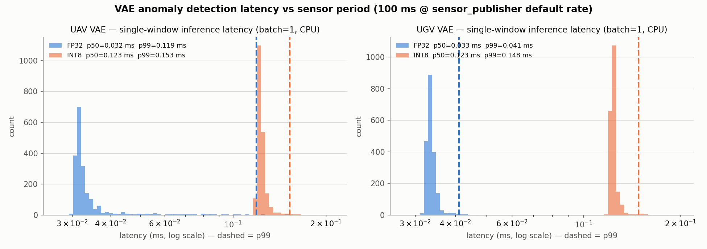
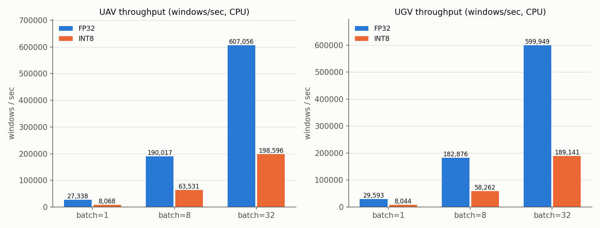

### 센서 주기 대비 실시간성 판단

`sensor_publisher.py` 의 발행 주기는 `rate_hz` 기본값 **10 Hz**, 즉 샘플당 예산 **100 ms** 입니다.

| 플랫폼 | 센서 주기 | p99 지연 (FP32) | 예산 사용률 | 여유 | 지속 가능 최대 주기 |
|---|---|---|---|---|---|
| UAV | 100 ms | 0.119 ms | 0.12 % | 839× | 8,393 Hz |
| UGV | 100 ms | 0.041 ms | 0.04 % | 2,431× | 24,313 Hz |

**실시간 처리 가능.** 최악(p99)에서도 주기의 0.12 % 만 사용하며, 단일 스레드로 UAV·UGV를
동시에 돌려도 여유가 3자리수 배입니다. Docker(linux/arm64) 컨테이너에서 재측정했을 때도
p99 는 1.91 ms(UAV) / 2.86 ms(UGV)로 예산의 3 % 미만이었습니다.
다만 **추론 지연 ≠ 탐지 지연**입니다. 실제 반응 시간은 슬라이딩 윈도우가 공격 데이터로
채워지는 시간(최대 20 샘플 = 2 s @10 Hz)과 위 점진적 스푸핑 실험의 탐지 지연(최대 500 ms)이
지배하며, ROS2/DDS 전송 지연은 포함되지 않았습니다.

### 경량화 (동적 양자화, qint8)

`torch.ao.quantization.quantize_dynamic(model, {nn.Linear}, qint8)` 적용 결과.

| 항목 | UAV | UGV |
|---|---|---|
| 모델 크기 (FP32 → INT8) | 244 KB → 71 KB (**-70.9 %**) | 284 KB → 81 KB (**-71.4 %**) |
| p50 지연 (batch=1, 호스트) | 0.032 → 0.123 ms (**3.8× 느려짐**) | 0.033 → 0.123 ms (**3.7× 느려짐**) |
| p50 지연 (batch=1, 컨테이너) | 0.163 → 0.100 ms (**1.6× 빨라짐**) | 0.178 → 0.114 ms (**1.6× 빨라짐**) |
| 정상 점수 p95 (임계값) | 1.2301 → 1.2293 | 1.1884 → 1.1884 |
| FP32-INT8 점수 상관 | Pearson r = 1.0000 | Pearson r = 1.0000 |
| 기존 임계값에서의 F1 | 0.9891 → 0.9891 (5개 공격 전부) | 0.9856 → 0.9856 (Wheel Slip / Cmd Anomaly) |

- **탐지 성능은 그대로**입니다. 재구성 오차 분포가 유지되므로 임계값 재보정 없이 양자화
  모델을 투입할 수 있습니다.
- **지연시간 이득은 환경에 따라 부호가 바뀝니다.** 행렬이 작아(최대 200×128) 양자화
  커널 오버헤드가 연산 절감을 넘어서는 경우가 있습니다. 이 규모에서 양자화의 근거는
  속도가 아니라 **메모리/플래시 71 % 절감**이며, 실제 타깃 보드에서 재확인이 필요합니다.

---

## 설명가능성 (SHAP)

"왜 이 경보가 울렸는가"를 운용자가 확인할 수 있어야 오탐 판단과 사후 검증이 가능합니다.
재구성 오차를 출력하는 함수를 `shap.KernelExplainer` 로 분해해, 어느 센서가 이상 점수를
만들었는지 정량화했습니다. 상세: [`explainability/README.md`](explainability/README.md).

- 설명 대상: `윈도우 → 재구성 오차(anomaly score)` 스칼라 함수 (모델 출력이 아님)
- 입력 20 타임스텝 × N 피처의 SHAP 값을 타임스텝 축으로 합산 → 센서 단위 기여도
- 배경 분포 `shap.kmeans(정상 윈도우, 30)`, `nsamples=8192`, 조건별 상위 10개 윈도우

| 플랫폼 | 조건 | SHAP 상위 3 | 기존 재구성오차 상위 3 | Spearman ρ |
|---|---|---|---|---|
| UAV | GPS Spoofing | residual_x, residual_y, gps_vel_x | 동일 | 1.00 |
| UAV | Altitude Spoofing | baro_alt, imu_ay, gps_vel_y | baro_alt, gps_vel_y, imu_ay | 0.88 |
| UAV | Command Injection | pitch_rate, gps_vel_y, imu_ay | 동일 | 0.93 |
| UGV | GPS Spoofing | residual_x, gps_vel_x, residual_y | residual_y, cmd_vel_x, gps_vel_y | **-0.08** |
| UGV | Wheel Slip | wheel_vel_l, wheel_vel_r, residual_x | 동일 | 1.00 |
| UGV | Command Anomaly | wheel_vel_l, wheel_vel_r, cmd_vel_x | 동일 | 0.94 |

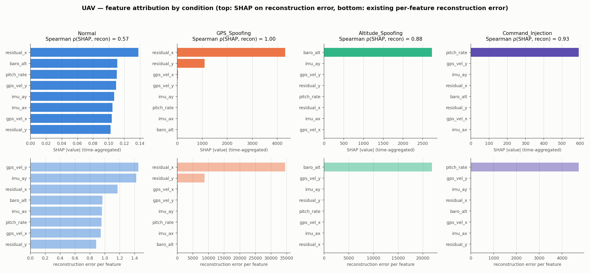
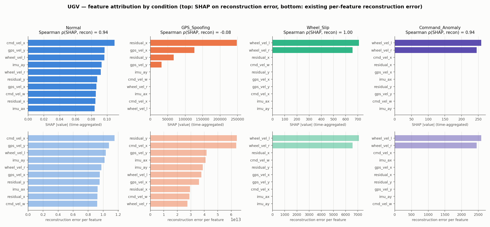

| UAV SHAP summary | UGV SHAP summary |
|---|---|
| 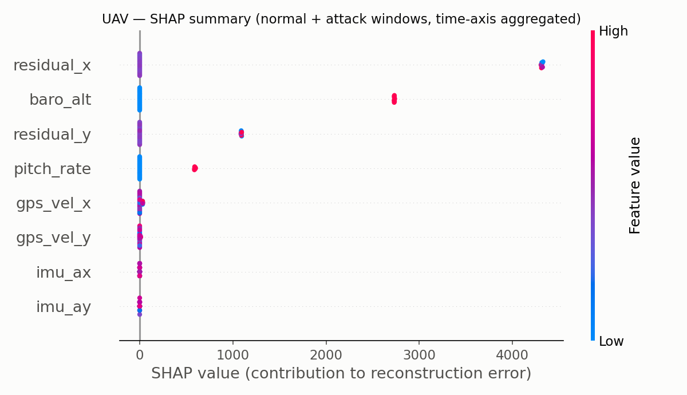 | 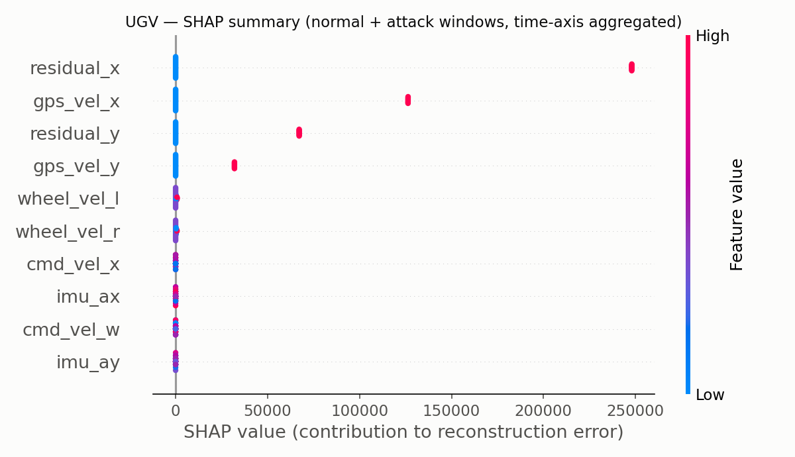 |

**공격 유형별 서명이 분리**되며, `anomaly_detector.py` 의 `FEATURE_TO_ATTACK` 매핑
(residual/gps → GPS_SPOOFING, baro_alt → ALTITUDE_SPOOFING, pitch_rate·휠 →
COMMAND_INJECTION)이 SHAP 기준으로도 근거가 있음을 확인했습니다.

**기존 기여도 이미지와의 대조 (정직한 기록)**

- **일치**: UAV GPS Spoofing / Altitude Spoofing, UGV Wheel Slip / Command Anomaly —
  상위 피처가 그대로 재현됩니다.
- **부분 불일치 (원인 규명)**: UAV Command Injection 은 기존 이미지에서 `imu_ax` 가 1위,
  SHAP 에서는 `pitch_rate` 가 1위입니다. 노트북 생성기는 `pitch_rate` + `imu_ax/ay` 를 함께
  교란하고, 본 분석이 쓴 `advanced_attacks.atk_cmd_injection()` 은 `pitch_rate` 만 교란하기
  때문입니다. 설명이 갈린 게 아니라 **설명 대상 데이터가 다릅니다.**
- **불일치 (기존 결과가 신뢰 불가 → 그림 재생성)**: UGV GPS Spoofing 의 초기 패널은 가로축이
  1e14 이고 휠 속도를 1위로 지목합니다. ① 노트북이 정상(n=1000)과 공격(n=300) 시계열을 섞어
  쓰면서 정규화 기준이 어긋났고(`generate_normal` 이 `linspace(0,10,n)` 의 gradient 로 속도를
  만들기 때문), ② 점수가 극단적으로 튀는 구간에서는 재구성 오차가 10개 피처 전체에 거의
  균일하게 퍼져 "최대 오차 피처" 휴리스틱이 무의미해지기 때문입니다.

  **재생성 결과(실측):** ①을 교정해 길이를 n=1000 으로 통일한 뒤에도 GPS 패널의 재구성 오차는
  여전히 포화 상태였습니다. 해당 윈도우의 이상 점수는 임계값의 **38만 배**(473,548 vs 1.2314)로,
  기여도가 2.7×10¹³~6.2×10¹³ 범위에 몰려(최대/최소 2.3배) **1위 점유율이 16 %** 에 그칩니다
  — 완전 균일(10 %)과 큰 차이가 없어 순위가 무의미하고, 실제로 주입과 무관한 `cmd_vel_x` 가
  2위로 올라옵니다. 같은 윈도우에서 SHAP 은 `residual_x`(1위 점유율 **52 %**), `gps_vel_x`,
  `residual_y`, `gps_vel_y` 를 상위 4개로 지목해 **실제 주입 열과 정확히 일치**했습니다.
  재생성 그림은 이 사실이 드러나도록 ㉠ 포화 패널을 회색 빗금 + 경고로 표시하고
  ㉡ 같은 윈도우의 SHAP 기여도를 아래 행에 나란히 배치했습니다.
  Wheel Slip / Command Anomaly 는 재생성 후에도 초기본과 결론이 같습니다(휠 속도 2개 지배,
  1위 점유율 50~52 %, SHAP 순위와 사실상 동일).

→ 중간 강도 이상까지는 온보드의 가벼운 휴리스틱으로 충분하지만, **점수가 임계값의 수백 배를
넘는 강한 공격에서는 휴리스틱의 피처 지목이 무너집니다.** 온보드는 휴리스틱을 유지하고
지상국에서 SHAP 으로 원인 센서를 확정하는 2단계 설명 구성을 권장합니다.

---

## 재현

```bash
# 로컬 (CPU)
make setup        # requirements.txt 설치
make test         # pytest 단위 테스트 (ROS2 불필요)
make benchmark    # 지연시간/처리량/양자화 벤치마크 → benchmarks/results.json
make explain      # SHAP 설명가능성 분석 → explainability/shap_results.json
make figures      # UGV 피처별 기여도 그림 재생성 → docs/images/ugv_feature_contribution.png
make attacks      # 기존 복합·점진적 공격 실험 재실행
make threshold    # ROC 기반 임계값 선택 근거 → analysis/threshold_results.json
make reproduce    # test + benchmark + explain + figures + threshold 전체

# Docker (CPU 전용 이미지, ROS2 불필요)
make docker-build           # = docker build -t haegeum-addon:cpu .
make docker-run             # 컨테이너에서 make reproduce
make docker-test            # 컨테이너에서 make test
```

- 난수 시드는 `utils/seed.py` 의 `set_seed(42)` 로 python/numpy/torch 를 함께 고정합니다.
- `benchmarks/` · `explainability/` · `analysis/` · `tests/` 는 모두 ROS2 없이 동작합니다.
  `utils/load_model.py` 가 rclpy 가 없을 때만 최소 스텁을 주입해
  **`anomaly_detector.py` 원본을 수정하지 않고** 동일한 `VAE` 클래스와 `vae_*.pth`
  가중치를 로드합니다.
- 지연시간은 하드웨어·부하에 따라 달라지므로, 재측정 시 `results.json` 의
  `meta.environment` 와 함께 읽어야 합니다.

### 테스트

`tests/` 에 pytest 기준 **106개 케이스**가 있습니다. 데이터·가중치만 있으면 되고
ROS2 없이 돌며, 호스트(Python 3.14.3)와 Docker 이미지(Python 3.12) 양쪽에서 전부
통과합니다. 실행 시간은 약 5초입니다.

| 파일 | 무엇을 고정하는가 |
|---|---|
| `test_model_loading.py` | ROS2 없이 원본 `anomaly_detector` import, VAE 입출력 형상(160/200 → latent 16), `PLATFORM_CONFIG` ↔ 데이터 생성기 피처 순서 일치, `FEATURE_TO_ATTACK` 매핑에 누락 피처 없음 |
| `test_reconstruction_error.py` | `mean((recon−x)²)` 의 기댓값(가짜 모델로 정확히 c²), numpy 참조 구현과 일치, 피처별 기여도 합 = 전체 점수, 주입 열에만 기여도 집중, 포화 입력에서 NaN/Inf 없음 |
| `test_detection_logic.py` | `score > threshold` strict 경계(임계값과 같으면 경보 아님, 최소 증분 위면 경보), 포화·무한대 점수, 경계 윈도우 제외 규칙, 탐지 지연 계산, 원본 `_infer`/`_classify` 를 가짜 노드에 바인딩해 XAI 분류 검증 |
| `test_seed_reproducibility.py` | `set_seed(42)` 후 python/numpy/torch 재현, VAE 샘플링 경로의 비트 단위 재현, 재시드 없으면 실제로 흔들린다는 사실(임계값 1.2283/1.2301 차이의 근거)과 그 흔들림이 10 % 미만이라는 것 |
| `test_attack_injection.py` | 각 공격 함수가 **의도한 피처 열만** 변형, 입력 배열 불변(공격 시계열 간 오염 방지), `residual = GPS − IMU` 항등식 유지, 점진 램프의 단조성·클리핑, UGV 생성기의 변형 구간이 `attack_regions` 와 일치 |
| `test_windowing.py` | 윈도우 개수(n−W+1), 길이 == 윈도우 크기인 최소 경계, 평탄화 순서가 (타임스텝, 피처), 라벨 경계(정상/경계/공격)가 한 칸도 밀리지 않음 |
| `test_threshold_metrics.py` | ROC 좌표가 모든 임계값에서 실제 판정과 일치, AUC 가 scikit-learn 과 동일(동점 포함), 각 선택 기준이 정의대로 동작(목표 FPR 예산 준수, 비용비↑ → 임계값↓) |

테스트를 쓰면서 실제로 드러난 것 두 가지를 그대로 고정해 두었습니다.
`atk_gps_sudden` 은 `mag·sin(0.2t)` 이라 주입 첫 샘플의 진폭이 0 이고(→ GPS 만 경계
탐지가 한 샘플 늦음), `sliding_windows` 는 길이가 윈도우보다 짧으면 빈 배열이 아니라
예외를 냅니다(→ "윈도우가 찰 때까지 호출하지 않는다"가 호출자 계약).

---

## 저장소 구조

```
haegeum-addon/
├── anomaly_detector.py        # L1 VAE 이상탐지 ROS2 노드 (GPS/IMU + 레이더 융합)
├── target_fusion.py           # L2 다중 소스(레이더/VAE/카메라) 가중 융합 노드
├── red_agent.py               # 4단계 자동 공격 캠페인 (RECON→EW→SWARM→PAYLOAD)
├── advanced_attacks.py        # 복합·점진적 공격 탐지 심화 실험 (standalone)
├── sensor_publisher.py        # 정상 센서 패턴 발행 노드 (테스트용)
├── ugv_agent.py               # UGV 상태 발행 / 임무 수신 노드
├── ugv_patrol.py              # UGV 순찰 웨이포인트 관리
├── UGV_anomaly_vae.ipynb      # UGV VAE 학습·평가 노트북 (Colab)
├── UAV_anomaly_vae_SEAD.ipynb # UAV VAE 학습·평가 노트북 (Colab)
├── advanced_attack_results.json  # 심화 실험 정량 결과
├── analysis/
│   ├── threshold_selection.py # ROC/AUC 기반 임계값 선택 근거 + Recall 원인 분해
│   └── threshold_results.json # 임계값 분석 실측 원시 결과
├── tests/                     # pytest 단위 테스트 106개 (ROS2 불필요)
│   ├── conftest.py            # 모델/데이터 픽스처 (ROS2 스텁 경유 로드)
│   ├── test_model_loading.py  # VAE 로드·출력 형상·설정 정합성
│   ├── test_reconstruction_error.py  # 이상 점수 계산의 정확성
│   ├── test_detection_logic.py       # 임계값 경계·포화·XAI 분류
│   ├── test_seed_reproducibility.py  # 시드 고정의 재현성
│   ├── test_attack_injection.py      # 공격 주입이 의도한 피처만 건드리는지
│   ├── test_windowing.py             # 윈도우/라벨 경계 조건
│   └── test_threshold_metrics.py     # ROC·AUC·기준 선택 로직
├── benchmarks/
│   ├── latency_benchmark.py   # CPU 추론 지연시간·처리량·양자화 벤치마크
│   ├── results.json           # 벤치마크 실측 원시 결과
│   └── README.md              # 측정 방법·환경·결과 표
├── explainability/
│   ├── shap_analysis.py       # 재구성 오차에 대한 SHAP 기여도 분석
│   ├── regen_ugv_feature_contribution.py  # UGV 기여도 그림 재생성
│   ├── shap_results.json      # SHAP 실측 원시 결과
│   ├── ugv_feature_contribution_regen.json  # 재생성 그림의 원시 수치
│   └── README.md              # 방산 체계에서의 필요성·기존 결과 대조
├── utils/
│   ├── seed.py                # 난수 시드 고정 + 측정 환경 기록
│   ├── load_model.py          # 기존 anomaly_detector.VAE·가중치 로더 (ROS2 스텁)
│   └── ugv_data.py            # UGV 합성 센서/공격 데이터 생성기
├── Dockerfile                 # CPU 재현 이미지 (ROS2 불필요)
├── Makefile                   # setup / test / benchmark / explain / threshold / reproduce
├── requirements.txt           # 버전 고정 의존성
├── vae_uav.pth                # UAV VAE 가중치 (input=160)
├── vae_ugv.pth                # UGV VAE 가중치 (input=200)
└── docs/
    └── images/                # 결과 그래프·혼동행렬·아키텍처 다이어그램
        └── legacy/            # 초기 분석본 보존 (재생성 전 그림)
```

---

## 실행 방법

### 심화 실험 (ROS2 불필요, 바로 실행 가능)

```bash
pip install torch numpy matplotlib
python advanced_attacks.py
# → docs 결과 PNG 3종 + advanced_attack_results.json 재생성
```

### ROS2 노드 (haegeum 통합 환경)

```bash
# 의존성
pip install torch numpy   # + ROS2 rclpy 환경

# 방어: anomaly_detector (UGV / UAV)
ros2 run haegeum_addon anomaly_detector --ros-args -p platform:=ugv -p robot_id:=ugv_01
ros2 run haegeum_addon anomaly_detector --ros-args -p platform:=uav -p robot_id:=uav_01

# 융합
ros2 run haegeum_addon target_fusion

# 공격 시뮬레이션
ros2 run haegeum_addon red_agent --ros-args -p swarm_size:=6

# 정상 센서 발행 (테스트)
ros2 run haegeum_addon sensor_publisher --ros-args -p platform:=ugv
```

> `haegeum_interfaces` 커스텀 메시지가 없으면 각 노드는 콘솔 출력 시뮬레이션 모드로 동작합니다.

### VAE 재학습

`UGV_anomaly_vae.ipynb` / `UAV_anomaly_vae_SEAD.ipynb` 를 Google Colab에서 실행하면 합성 데이터로 VAE를 학습하고 `vae_*.pth` 를 생성합니다.

---

## 기술 스택

- **딥러닝**: PyTorch (VAE, reparameterization trick)
- **로보틱스 미들웨어**: ROS2 (rclpy, Float32MultiArray, 커스텀 msg)
- **수치/시각화**: NumPy, Matplotlib
- **XAI**: 피처별 재구성 오차 기여도 분석, SHAP (KernelExplainer)
- **경량화/프로파일링**: PyTorch 동적 양자화(qint8), 지연시간 분위수(p50/p95/p99) 측정
- **재현성**: Docker (CPU), Makefile, 버전 고정 requirements, 시드 고정 유틸
- **테스트**: pytest 106 케이스 (ROS2 스텁 경유, 호스트·컨테이너 양쪽 통과)
- **위협 모델링**: MITRE ATT&CK for ICS, STANAG 4586 시나리오 매핑
- **평가**: Precision / Recall / F1, ROC·AUC, 임계값 선택 기준 비교(Youden's J / 목표 FPR / F1 최대 / 비용 최소), 탐지 지연(ms), 혼동행렬, FP/FN 피처 분포

---

## 한계 및 향후 과제

- **합성 데이터 기반**: 정상/공격 데이터를 시뮬레이션으로 생성했습니다. 실제 GPS 스푸핑 공개 데이터셋(예: Mendeley DOI 10.17632/z7dj3yyzt8.3)으로 교체·검증이 필요합니다.
- **경계 구간 탐지 지연**: 슬라이딩 윈도우 특성상 공격 시작 직후 윈도우에는 정상 데이터가 섞입니다. 다만 실측해 보면 20샘플 중 1~2샘플만 오염돼도 탐지되어 지연은 100~200 ms 수준이고, 점진적 공격에서만 300~600 ms 로 늘어납니다(「실험 결과」 3-d).
- **약한 편향은 탐지하지 못함**: 정상 피처 표준편차 기준 **GPS 0.1σ 미만, 고도·휠 1σ 미만**의 편향은 AUC 가 0.5~0.8 대로 떨어져 사실상 탐지 범위 밖입니다. 임계값을 내려 잡는 것은 해법이 아니며(오경보율이 비례해 폭증), 멀티스케일 윈도우·변화율 기반 보조 탐지·다른 센서 계층과의 융합이 필요합니다.
- **임계값 기본값과 권고치의 괴리**: 코드 기본값은 기존 실험과의 연속성을 위해 정상 95th percentile 을 유지했습니다. 그러나 ROC 분석상 이 값은 정상 점수 최댓값보다 낮아 파레토 열위이며, 명목 강도 공격만 고려하면 UAV 1.4553 / UGV 1.4393 이상으로 올리는 편이 낫습니다(Recall 손실 0, FPR 0). 실데이터로 정상 분포를 다시 재기 전까지는 기본값을 바꾸지 않고 근거만 문서화했습니다.
- **오경보율 검증 한계**: 평가에 쓴 정상 데이터는 981 윈도우(10 Hz 기준 98초)뿐이라 0.1 % 미만의 FPR 은 측정 자체가 불가능합니다. 실제 운용 기준(시간당 1건 미만 등)을 주장하려면 수십 시간 분량의 실제 정상 데이터가 필요합니다.
- **점진적 스푸핑 취약성**: 값을 아주 천천히 올리는 공격에서 지연이 커집니다(최대 500 ms 관측). 온라인 임계값 적응이나 변화율(rate) 기반 보조 탐지가 필요합니다.
- **오탐 관리**: 분산이 큰 피처(`residual`, `pitch_rate`)에서 소수의 오탐이 남습니다. 피처별 정규화·robust threshold로 저감 가능.
- **평가 라벨 정정 이력**: 초기 노트북 평가는 공격 시계열 전체를 양성으로 라벨링해 Recall 0.714 를 기록했습니다. 원인 분해 결과 그 FN 의 98 %가 공격이 주입되지 않은 윈도우였습니다(「실험 결과」 3-d). 노트북 자체의 라벨링은 이력 보존을 위해 그대로 두고, 교정된 평가를 별도로 제시합니다.
- **레이더 융합 미검증**: 레이더/카메라 융합 로직은 구현되어 있으나 정량 평가는 향후 과제입니다.
- **지연시간 측정 범위**: 추론 커널만 측정했습니다. ROS2/DDS 전송 지연, 실제 온보드 SoC
  (Jetson 계열 등)에서의 재측정, 다중 노드 동시 구동 시의 간섭은 포함되지 않았습니다.
- **강한 공격에서의 설명 붕괴**: 점수가 임계값의 수백 배를 넘는 구간에서 기존 피처별
  재구성 오차 휴리스틱의 원인 지목이 무너지는 것을 SHAP 대조로 확인했습니다
  (`explainability/README.md`). 온보드 경량 설명 기법의 개선이 필요합니다.

---

## 참고

- MITRE ATT&CK for ICS — https://attack.mitre.org/matrices/ics/
- STANAG 4586 — UAV 지상통제 스테이션 인터페이스 표준
- 본 저장소는 DAH 2026 팀 **해금**의 통합 시스템 중 **L1 방어 + Red Agent 모듈** 부분입니다.
