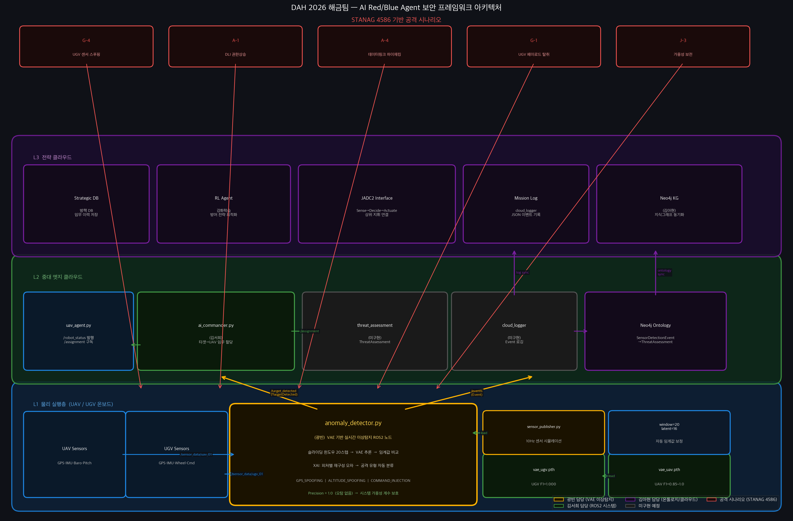

# 해금(Haegeum) — UAV/UGV 통합 VAE 이상탐지 & Red Agent 공격 시뮬레이션

> 유·무인 복합체계(MUM-T)의 센서 무결성을 실시간으로 검증하는 **L1 방어(Blue) 모듈**과, 이를 시험·평가하기 위한 **4단계 자동 공격 캠페인(Red Agent)**을 함께 담은 방산 AI 보안 프레임워크입니다.
>
> DAH 2026(국방 AI 해커톤) 출전작 · 팀 **해금**


> ⚠️ **범위 고지**: 이 저장소의 모든 공격/방어 코드는 **합성 데이터 기반 시뮬레이션**이며, ROS2 토픽 메시지 위·변조 실험에 한정됩니다. 실제 무기체계나 실기체에 대한 운용 정보를 포함하지 않습니다.

---

## 문제 정의

유·무인 복합체계(UAV/UGV)는 GPS·IMU·기압계·레이더·EO/IR 등 다수의 센서에 의존해 항법과 임무를 수행합니다. 그러나 이 센서 계층은 다음과 같은 위협에 직접 노출됩니다.

- **GPS 스푸핑 / 재밍** — 위조 위성 신호로 위치·속도 추정을 오염시켜 경로 이탈을 유도
- **데이터링크 하이재킹 / 명령 주입** — MAVLink 등 제어 링크를 가로채 고도·자세 명령을 위조
- **군집 드론 포화(Saturation)** — 다방향 동시 접근으로 탐지·분류·의사결정 파이프라인을 과부하

이러한 공격은 임무 시작 후 **수백 ms 단위**로 전개되므로, 클라우드 재분석을 기다릴 수 없습니다. 따라서 **기체 온보드(L1)에서 센서 스트림 자체의 이상 거동을 실시간으로 탐지**하는 자기 방어 계층이 필요합니다.

본 프로젝트는 정상 센서 패턴만 학습한 **VAE(Variational Autoencoder)** 로 재구성 오차 기반 이상탐지를 수행하고, **XAI(피처별 기여도)** 로 어떤 센서가 공격받았는지 식별합니다. 동시에, 방어 성능을 정량 평가하기 위한 **Red Agent 자동 공격 캠페인**을 함께 구현했습니다.

---

## 시스템 구조

각 노드는 ROS2(rclpy) 노드로 동작하며, `haegeum_interfaces` 커스텀 메시지가 없는 환경에서는 자동으로 시뮬레이션 모드로 폴백합니다.

```
                        ┌─────────────────────────────────────────────┐
                        │            Red Agent (공격 AI)               │
                        │   red_agent.py · advanced_attacks.py         │
                        │   RECON → EW → SWARM → PAYLOAD (4단계)        │
                        └───────────────┬─────────────────────────────┘
                                        │ 위조 센서/레이더/허위표적 주입
                                        ▼
   ┌────────────────┐        ┌────────────────────────┐
   │ sensor_publisher│──정상─▶│  /sensor_data/{robot}  │
   │  (정상 패턴)     │        │  /radar_tracks         │
   └────────────────┘        └───────────┬────────────┘
                                          ▼
                        ┌──────────────────────────────────────┐
                        │   anomaly_detector.py  (L1 방어)      │
                        │   ① VAE 센서 이상탐지 (GPS/IMU)        │
                        │   ② 레이더 트랙 군집 탐지 (SWARM)      │
                        │   ③ XAI 피처 기여도 → 공격유형 분류    │
                        └───────────────┬──────────────────────┘
                                        │ /target_detected (Event)
                                        ▼
                        ┌──────────────────────────────────────┐
                        │   target_fusion.py  (L2 엣지)         │
                        │   VAE(0.50)+Radar(0.35)+Camera(0.15)  │
                        │   가중 신뢰도 융합 → /fused_targets    │
                        └───────────────┬──────────────────────┘
                                        ▼
                        ┌──────────────────────────────────────┐
                        │  ai_commander (외부) → /assignment    │
                        │  ugv_agent.py / ugv_patrol.py 로 임무  │
                        └──────────────────────────────────────┘
```



### VAE 구조 (anomaly_detector.py / advanced_attacks.py 기준)

| 항목 | 값 |
|---|---|
| 입력 | 슬라이딩 윈도우 20 타임스텝 × 피처 수 (UAV 8 → 160차원, UGV 10 → 200차원) |
| 인코더 | Linear(input→128) → ReLU → Linear(128→64) → ReLU |
| Latent | `latent_dim = 16` (mu / logvar 분기, reparameterization) |
| 디코더 | Linear(16→64) → ReLU → Linear(64→128) → ReLU → Linear(128→input) |
| 이상 점수 | 재구성 MSE `mean((recon − x)²)` |
| 임계값 | **정상 검증셋 재구성 오차의 95th percentile** (calib_size=200 온라인 보정). 이는 곧 *목표 FPR 5 % 고정* 규칙이며 ROC 최적이 아닙니다 — 근거와 권고치는 「실험 결과」 3) 참조 |
| XAI | 윈도우 내 피처별 재구성 오차 평균 → argmax 피처를 `FEATURE_TO_ATTACK` 매핑으로 공격유형 분류 |

- **UAV 피처(8)**: `gps_vel_x/y`, `imu_ax/ay`, `residual_x/y`, `baro_alt`, `pitch_rate`
- **UGV 피처(10)**: `gps_vel_x/y`, `imu_ax/ay`, `residual_x/y`, `wheel_vel_l/r`, `cmd_vel_x/w`
- **핵심 아이디어**: `residual = GPS속도 − IMU가속도`. 정상 주행/비행에서는 ≈0 이지만, GPS만 위조되면 residual이 폭발 → 스푸핑을 물리 정합성 위반으로 탐지.

### 센서 융합 로직 (target_fusion.py)

- 3개 소스를 **가중 평균 신뢰도 융합**: VAE 0.50 / 레이더 0.35 / 카메라 0.15
- 동일 표적 판단: 유클리드 거리 `< 20m`(`FUSION_RADIUS`) 이면 동일 표적으로 병합
- 레이더 트랙 `[track_id, range_m, az_deg, el_deg, radial_vel, rcs_dbsm]` 을 극좌표→직교좌표 변환, RCS 기반 신뢰도 산정
- 5초 미갱신 표적은 stale 제거

---

## 위협 모델 / 공격 시나리오

Red Agent는 APT(지능형 지속 위협) 구조를 모사한 **4단계 캠페인**을 10Hz 루프로 자동 전개합니다. (`red_agent.py`)

| 단계 | 이름 | 공격 벡터 | 주입 파라미터 | MITRE ATT&CK for ICS |
|---|---|---|---|---|
| Phase 1 | RECON (정찰) | 저고도(15m)·저속(8m/s) 스카우트 드론 1대, 낮은 RCS(≈−10 dBsm) | `/radar_tracks` 단일 트랙 | T0842 Network Sniffing |
| Phase 2 | EW (전자전) | GPS 스푸핑 + 고도 스푸핑 + 명령 주입 | `gps_vel ±12m/s`, `baro_alt +25m`, `pitch_rate` 진동 | T0830 AiTM · T0855 Unauthorized Command |
| Phase 3 | SWARM (포화) | 군집 드론 6대, 360°/60° 간격 동시 접근(20m/s), 새떼 위장 RCS | `/radar_tracks` 다중 트랙 + 허위표적 flood | T0814 Denial of Service |
| Phase 4 | PAYLOAD (페이로드) | 우군 UGV `cmd_vel` 역방향 위조 → 임무 구역 이탈 | `cmd_vel = −1.0` | T0803 Block Command Message |

### 방어 관점 STANAG 4586 시나리오 커버리지

| 시나리오 | 탐지 피처 | 탐지 소스 |
|---|---|---|
| G-4 UGV 센서 스푸핑 | `residual_x/y` 폭발 | VAE |
| A-4 데이터링크 하이재킹 | `baro_alt`, `pitch_rate` | VAE |
| G-1 UGV 페이로드 탈취 | `wheel_vel`, `cmd_vel` | VAE |
| J-3 가용성 보전 | 낮은 오탐(FP) 유지 | VAE |
| SWARM 군집 재밍 | 동시 트랙 수 ≥ 3 & 접근속도 ≥ 15 m/s | 레이더 |

### 심화 실험 공격 유형 (advanced_attacks.py)

예선 이후 본선 추가 연구로, 단일 공격을 넘어선 **복합·점진적 공격**의 탐지 강건성을 검증했습니다.

- **복합 공격**: GPS+명령주입, GPS+고도 (두 센서 동시 오염)
- **점진적 스푸핑**: 값을 선형 램프로 서서히 증가시켜 임계값을 우회하려는 시도 (rate 0.1~0.5)
- **FP/FN 피처 분포 분석**: 오탐이 발생한 윈도우에서 어떤 피처가 정상 분포 대비 몇 σ 벗어났는지 정량화

---

## 핵심 결과

합성 센서 데이터 기준입니다. 전체 분석은 [docs/실험결과_상세.md](docs/실험결과_상세.md)에 있습니다.

| | UAV | UGV |
|---|---|---|
| 명목 강도 공격 AUC | 1.0000 | 1.0000 |
| 공격으로 가득 찬 윈도우 Recall | 1.0000 | 1.0000 |
| 탐지 한계 근방 AUC | 0.8322 | 0.8271 |
| 탐지 하한 (편향 크기) | GPS 0.1σ · 고도 2σ | GPS 1σ · 휠 2σ |
| p99 추론 지연 (batch=1, CPU) | 0.119 ms | 0.041 ms |
| INT8 양자화 시 모델 크기 | -70.9 % | -71.4 % |

센서 발행 주기가 10 Hz(샘플당 예산 100 ms)이므로 p99 기준 예산의 0.12 % 이하를 씁니다.
양자화 후에도 탐지 F1은 전 공격에서 변하지 않습니다.

### 알아둘 것 세 가지

**1. 임계값은 현재 최적이 아닙니다.** 기본값 1.2301(UAV)은 "정상 점수 95 퍼센타일" 규칙으로 정한 값인데,
정상 점수 최댓값 1.4553보다 낮습니다. 명목 강도 공격에서는 [1.4553, 22.1077] 구간이 정상과 공격을 완전히
분리하므로, 임계값을 그 구간으로 올리면 Recall 1.0을 유지한 채 오탐률 3.26 % → 0 %가 됩니다.
현재 값은 파레토 열위이며, 기본값을 바꾸지 않고 근거만 문서화했습니다.

**2. 기존에 보고하던 Recall 0.714는 모델의 미탐률이 아닙니다.** 공격이 한 샘플도 주입되지 않은 윈도우까지
양성으로 라벨링한 결과입니다. 미탐 707건 중 693건(98.0 %)이 이 경우이고, 공격으로 가득 찬 윈도우의
미탐은 0건입니다. 초기 README의 설명("경계 윈도우 때문")은 틀렸으며 상세 문서에서 정정했습니다.

**3. 전부 합성 데이터입니다.** AUC 1.0은 모델이 뛰어나다는 뜻이 아니라 데이터가 쉽다는 뜻입니다.
실제 GPS 스푸핑 데이터셋 검증은 하지 않았습니다.

## 빠른 시작

```bash
git clone https://github.com/gawbi/haegeum-addon.git && cd haegeum-addon
pip install -r requirements.txt
make test          # 테스트 106개 (약 5초)
make benchmark     # 추론 지연 측정
```

ROS2 없이도 전부 동작합니다. 도커를 쓰려면 `make docker-test`.
자세한 재현 절차는 아래 「재현」 절에 있습니다.

## 재현

```bash
# 로컬 (CPU)
make setup        # requirements.txt 설치
make test         # pytest 단위 테스트 (ROS2 불필요)
make benchmark    # 지연시간/처리량/양자화 벤치마크 → benchmarks/results.json
make explain      # SHAP 설명가능성 분석 → explainability/shap_results.json
make figures      # UGV 피처별 기여도 그림 재생성 → docs/images/ugv_feature_contribution.png
make attacks      # 기존 복합·점진적 공격 실험 재실행
make threshold    # ROC 기반 임계값 선택 근거 → analysis/threshold_results.json
make reproduce    # test + benchmark + explain + figures + threshold 전체

# Docker (CPU 전용 이미지, ROS2 불필요)
make docker-build           # = docker build -t haegeum-addon:cpu .
make docker-run             # 컨테이너에서 make reproduce
make docker-test            # 컨테이너에서 make test
```

- 난수 시드는 `utils/seed.py` 의 `set_seed(42)` 로 python/numpy/torch 를 함께 고정합니다.
- `benchmarks/` · `explainability/` · `analysis/` · `tests/` 는 모두 ROS2 없이 동작합니다.
  `utils/load_model.py` 가 rclpy 가 없을 때만 최소 스텁을 주입해
  **`anomaly_detector.py` 원본을 수정하지 않고** 동일한 `VAE` 클래스와 `vae_*.pth`
  가중치를 로드합니다.
- 지연시간은 하드웨어·부하에 따라 달라지므로, 재측정 시 `results.json` 의
  `meta.environment` 와 함께 읽어야 합니다.

### 테스트

`tests/` 에 pytest 기준 **106개 케이스**가 있습니다. 데이터·가중치만 있으면 되고
ROS2 없이 돌며, 호스트(Python 3.14.3)와 Docker 이미지(Python 3.12) 양쪽에서 전부
통과합니다. 실행 시간은 약 5초입니다.

| 파일 | 무엇을 고정하는가 |
|---|---|
| `test_model_loading.py` | ROS2 없이 원본 `anomaly_detector` import, VAE 입출력 형상(160/200 → latent 16), `PLATFORM_CONFIG` ↔ 데이터 생성기 피처 순서 일치, `FEATURE_TO_ATTACK` 매핑에 누락 피처 없음 |
| `test_reconstruction_error.py` | `mean((recon−x)²)` 의 기댓값(가짜 모델로 정확히 c²), numpy 참조 구현과 일치, 피처별 기여도 합 = 전체 점수, 주입 열에만 기여도 집중, 포화 입력에서 NaN/Inf 없음 |
| `test_detection_logic.py` | `score > threshold` strict 경계(임계값과 같으면 경보 아님, 최소 증분 위면 경보), 포화·무한대 점수, 경계 윈도우 제외 규칙, 탐지 지연 계산, 원본 `_infer`/`_classify` 를 가짜 노드에 바인딩해 XAI 분류 검증 |
| `test_seed_reproducibility.py` | `set_seed(42)` 후 python/numpy/torch 재현, VAE 샘플링 경로의 비트 단위 재현, 재시드 없으면 실제로 흔들린다는 사실(임계값 1.2283/1.2301 차이의 근거)과 그 흔들림이 10 % 미만이라는 것 |
| `test_attack_injection.py` | 각 공격 함수가 **의도한 피처 열만** 변형, 입력 배열 불변(공격 시계열 간 오염 방지), `residual = GPS − IMU` 항등식 유지, 점진 램프의 단조성·클리핑, UGV 생성기의 변형 구간이 `attack_regions` 와 일치 |
| `test_windowing.py` | 윈도우 개수(n−W+1), 길이 == 윈도우 크기인 최소 경계, 평탄화 순서가 (타임스텝, 피처), 라벨 경계(정상/경계/공격)가 한 칸도 밀리지 않음 |
| `test_threshold_metrics.py` | ROC 좌표가 모든 임계값에서 실제 판정과 일치, AUC 가 scikit-learn 과 동일(동점 포함), 각 선택 기준이 정의대로 동작(목표 FPR 예산 준수, 비용비↑ → 임계값↓) |

테스트를 쓰면서 실제로 드러난 것 두 가지를 그대로 고정해 두었습니다.
`atk_gps_sudden` 은 `mag·sin(0.2t)` 이라 주입 첫 샘플의 진폭이 0 이고(→ GPS 만 경계
탐지가 한 샘플 늦음), `sliding_windows` 는 길이가 윈도우보다 짧으면 빈 배열이 아니라
예외를 냅니다(→ "윈도우가 찰 때까지 호출하지 않는다"가 호출자 계약).

---

## 저장소 구조

```
haegeum-addon/
├── anomaly_detector.py        # L1 VAE 이상탐지 ROS2 노드 (GPS/IMU + 레이더 융합)
├── target_fusion.py           # L2 다중 소스(레이더/VAE/카메라) 가중 융합 노드
├── red_agent.py               # 4단계 자동 공격 캠페인 (RECON→EW→SWARM→PAYLOAD)
├── advanced_attacks.py        # 복합·점진적 공격 탐지 심화 실험 (standalone)
├── sensor_publisher.py        # 정상 센서 패턴 발행 노드 (테스트용)
├── ugv_agent.py               # UGV 상태 발행 / 임무 수신 노드
├── ugv_patrol.py              # UGV 순찰 웨이포인트 관리
├── UGV_anomaly_vae.ipynb      # UGV VAE 학습·평가 노트북 (Colab)
├── UAV_anomaly_vae_SEAD.ipynb # UAV VAE 학습·평가 노트북 (Colab)
├── advanced_attack_results.json  # 심화 실험 정량 결과
├── analysis/
│   ├── threshold_selection.py # ROC/AUC 기반 임계값 선택 근거 + Recall 원인 분해
│   └── threshold_results.json # 임계값 분석 실측 원시 결과
├── tests/                     # pytest 단위 테스트 106개 (ROS2 불필요)
│   ├── conftest.py            # 모델/데이터 픽스처 (ROS2 스텁 경유 로드)
│   ├── test_model_loading.py  # VAE 로드·출력 형상·설정 정합성
│   ├── test_reconstruction_error.py  # 이상 점수 계산의 정확성
│   ├── test_detection_logic.py       # 임계값 경계·포화·XAI 분류
│   ├── test_seed_reproducibility.py  # 시드 고정의 재현성
│   ├── test_attack_injection.py      # 공격 주입이 의도한 피처만 건드리는지
│   ├── test_windowing.py             # 윈도우/라벨 경계 조건
│   └── test_threshold_metrics.py     # ROC·AUC·기준 선택 로직
├── benchmarks/
│   ├── latency_benchmark.py   # CPU 추론 지연시간·처리량·양자화 벤치마크
│   ├── results.json           # 벤치마크 실측 원시 결과
│   └── README.md              # 측정 방법·환경·결과 표
├── explainability/
│   ├── shap_analysis.py       # 재구성 오차에 대한 SHAP 기여도 분석
│   ├── regen_ugv_feature_contribution.py  # UGV 기여도 그림 재생성
│   ├── shap_results.json      # SHAP 실측 원시 결과
│   ├── ugv_feature_contribution_regen.json  # 재생성 그림의 원시 수치
│   └── README.md              # 방산 체계에서의 필요성·기존 결과 대조
├── utils/
│   ├── seed.py                # 난수 시드 고정 + 측정 환경 기록
│   ├── load_model.py          # 기존 anomaly_detector.VAE·가중치 로더 (ROS2 스텁)
│   └── ugv_data.py            # UGV 합성 센서/공격 데이터 생성기
├── Dockerfile                 # CPU 재현 이미지 (ROS2 불필요)
├── Makefile                   # setup / test / benchmark / explain / threshold / reproduce
├── requirements.txt           # 버전 고정 의존성
├── vae_uav.pth                # UAV VAE 가중치 (input=160)
├── vae_ugv.pth                # UGV VAE 가중치 (input=200)
└── docs/
    ├── 실험결과_상세.md        # 공격별 성능·ROC 기준 비교·탐지 하한·Recall 분해
    ├── 실시간성능_상세.md      # 지연 분포·배치별 처리량·양자화 비교
    ├── 설명가능성_상세.md      # SHAP 기여도·기존 분석 대조
    └── images/                # 결과 그래프·혼동행렬·아키텍처 다이어그램
        └── legacy/            # 초기 분석본 보존 (재생성 전 그림)
```

---

## 실행 방법

### 심화 실험 (ROS2 불필요, 바로 실행 가능)

```bash
pip install torch numpy matplotlib
python advanced_attacks.py
# → docs 결과 PNG 3종 + advanced_attack_results.json 재생성
```

### ROS2 노드 (haegeum 통합 환경)

```bash
# 의존성
pip install torch numpy   # + ROS2 rclpy 환경

# 방어: anomaly_detector (UGV / UAV)
ros2 run haegeum_addon anomaly_detector --ros-args -p platform:=ugv -p robot_id:=ugv_01
ros2 run haegeum_addon anomaly_detector --ros-args -p platform:=uav -p robot_id:=uav_01

# 융합
ros2 run haegeum_addon target_fusion

# 공격 시뮬레이션
ros2 run haegeum_addon red_agent --ros-args -p swarm_size:=6

# 정상 센서 발행 (테스트)
ros2 run haegeum_addon sensor_publisher --ros-args -p platform:=ugv
```

> `haegeum_interfaces` 커스텀 메시지가 없으면 각 노드는 콘솔 출력 시뮬레이션 모드로 동작합니다.

### VAE 재학습

`UGV_anomaly_vae.ipynb` / `UAV_anomaly_vae_SEAD.ipynb` 를 Google Colab에서 실행하면 합성 데이터로 VAE를 학습하고 `vae_*.pth` 를 생성합니다.

---

## 기술 스택

- **딥러닝**: PyTorch (VAE, reparameterization trick)
- **로보틱스 미들웨어**: ROS2 (rclpy, Float32MultiArray, 커스텀 msg)
- **수치/시각화**: NumPy, Matplotlib
- **XAI**: 피처별 재구성 오차 기여도 분석, SHAP (KernelExplainer)
- **경량화/프로파일링**: PyTorch 동적 양자화(qint8), 지연시간 분위수(p50/p95/p99) 측정
- **재현성**: Docker (CPU), Makefile, 버전 고정 requirements, 시드 고정 유틸
- **테스트**: pytest 106 케이스 (ROS2 스텁 경유, 호스트·컨테이너 양쪽 통과)
- **위협 모델링**: MITRE ATT&CK for ICS, STANAG 4586 시나리오 매핑
- **평가**: Precision / Recall / F1, ROC·AUC, 임계값 선택 기준 비교(Youden's J / 목표 FPR / F1 최대 / 비용 최소), 탐지 지연(ms), 혼동행렬, FP/FN 피처 분포

---

## 한계 및 향후 과제

- **합성 데이터 기반**: 정상/공격 데이터를 시뮬레이션으로 생성했습니다. 실제 GPS 스푸핑 공개 데이터셋(예: Mendeley DOI 10.17632/z7dj3yyzt8.3)으로 교체·검증이 필요합니다.
- **경계 구간 탐지 지연**: 슬라이딩 윈도우 특성상 공격 시작 직후 윈도우에는 정상 데이터가 섞입니다. 다만 실측해 보면 20샘플 중 1~2샘플만 오염돼도 탐지되어 지연은 100~200 ms 수준이고, 점진적 공격에서만 300~600 ms 로 늘어납니다(「실험 결과」 3-d).
- **약한 편향은 탐지하지 못함**: 정상 피처 표준편차 기준 **GPS 0.1σ 미만, 고도·휠 1σ 미만**의 편향은 AUC 가 0.5~0.8 대로 떨어져 사실상 탐지 범위 밖입니다. 임계값을 내려 잡는 것은 해법이 아니며(오경보율이 비례해 폭증), 멀티스케일 윈도우·변화율 기반 보조 탐지·다른 센서 계층과의 융합이 필요합니다.
- **임계값 기본값과 권고치의 괴리**: 코드 기본값은 기존 실험과의 연속성을 위해 정상 95th percentile 을 유지했습니다. 그러나 ROC 분석상 이 값은 정상 점수 최댓값보다 낮아 파레토 열위이며, 명목 강도 공격만 고려하면 UAV 1.4553 / UGV 1.4393 이상으로 올리는 편이 낫습니다(Recall 손실 0, FPR 0). 실데이터로 정상 분포를 다시 재기 전까지는 기본값을 바꾸지 않고 근거만 문서화했습니다.
- **오경보율 검증 한계**: 평가에 쓴 정상 데이터는 981 윈도우(10 Hz 기준 98초)뿐이라 0.1 % 미만의 FPR 은 측정 자체가 불가능합니다. 실제 운용 기준(시간당 1건 미만 등)을 주장하려면 수십 시간 분량의 실제 정상 데이터가 필요합니다.
- **점진적 스푸핑 취약성**: 값을 아주 천천히 올리는 공격에서 지연이 커집니다(최대 500 ms 관측). 온라인 임계값 적응이나 변화율(rate) 기반 보조 탐지가 필요합니다.
- **오탐 관리**: 분산이 큰 피처(`residual`, `pitch_rate`)에서 소수의 오탐이 남습니다. 피처별 정규화·robust threshold로 저감 가능.
- **평가 라벨 정정 이력**: 초기 노트북 평가는 공격 시계열 전체를 양성으로 라벨링해 Recall 0.714 를 기록했습니다. 원인 분해 결과 그 FN 의 98 %가 공격이 주입되지 않은 윈도우였습니다(「실험 결과」 3-d). 노트북 자체의 라벨링은 이력 보존을 위해 그대로 두고, 교정된 평가를 별도로 제시합니다.
- **레이더 융합 미검증**: 레이더/카메라 융합 로직은 구현되어 있으나 정량 평가는 향후 과제입니다.
- **지연시간 측정 범위**: 추론 커널만 측정했습니다. ROS2/DDS 전송 지연, 실제 온보드 SoC
  (Jetson 계열 등)에서의 재측정, 다중 노드 동시 구동 시의 간섭은 포함되지 않았습니다.
- **강한 공격에서의 설명 붕괴**: 점수가 임계값의 수백 배를 넘는 구간에서 기존 피처별
  재구성 오차 휴리스틱의 원인 지목이 무너지는 것을 SHAP 대조로 확인했습니다
  (`explainability/README.md`). 온보드 경량 설명 기법의 개선이 필요합니다.

---

## 더 읽을거리

| 문서 | 내용 |
|---|---|
| [docs/실험결과_상세.md](docs/실험결과_상세.md) | 공격별 성능, ROC 기준 5종 비교, 탐지 하한 스윕, Recall 분해 |
| [docs/실시간성능_상세.md](docs/실시간성능_상세.md) | 지연 분포, 배치별 처리량, 양자화 전후 비교 |
| [docs/설명가능성_상세.md](docs/설명가능성_상세.md) | SHAP 기여도, 기존 분석과의 대조 |
| [benchmarks/README.md](benchmarks/README.md) | 벤치마크 방법론과 측정 환경 |
| [explainability/README.md](explainability/README.md) | SHAP 분석 방법론 |

## 참고

- MITRE ATT&CK for ICS — https://attack.mitre.org/matrices/ics/
- STANAG 4586 — UAV 지상통제 스테이션 인터페이스 표준
- 본 저장소는 DAH 2026 팀 **해금**의 통합 시스템 중 **L1 방어 + Red Agent 모듈** 부분입니다.
